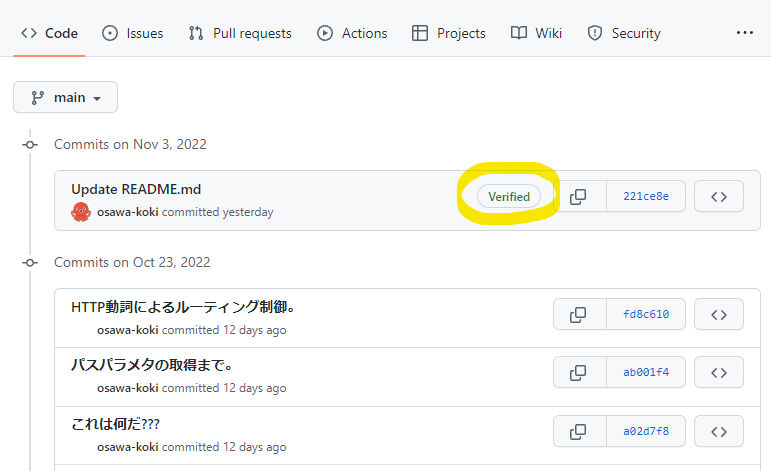
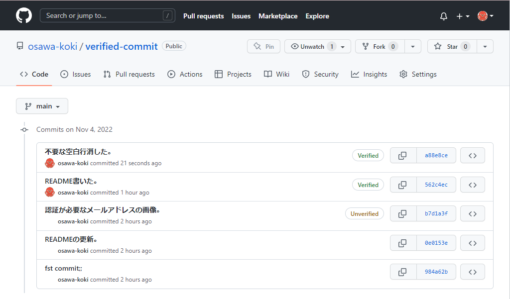

# verified commit

<!-- Gitコミットに署名をして、正当性を証明する♪ -->

GitHubへのコミットに対して認証をしてみる。  
なんか認証があったほうがカッコいいよね🥺🥺🥺🥺🥺  

  

## 環境情報

| 機能 | バージョン |
| ---- | ---- |
| Windows | 11 Home |

## 手順

### Gpg4winのインストール

[こちら](https://gpg4win.org/get-gpg4win.html)からgpg署名を行うためのソフトウェアをインストールします。  

正しくインストールが完了したかはコマンドプロンプトで以下のコマンドを実行することで確認できます。  

```shell
gpg
```

### 鍵の発行

では、先ほどインストールしたgpgコマンドを使用して、鍵を発行します。  

```shell
gpg --full-gen-key
```

以下の内容を尋ねられます。  

```shell
ご希望の鍵の種類を選択してください:
   (1) RSA と RSA
   (2) DSA と Elgamal
   (3) DSA (署名のみ)
   (4) RSA (署名のみ)
   (9) ECC (署名と暗号化) *デフォルト
  (10) ECC (署名のみ)
  (14) カードに存在する鍵

# -> 1

RSA 鍵は 1024 から 4096 ビットの長さで可能です。
鍵長は? (3072)

# -> 2048

鍵の有効期限を指定してください。
         0 = 鍵は無期限
      <n>  = 鍵は n 日間で期限切れ
      <n>w = 鍵は n 週間で期限切れ
      <n>m = 鍵は n か月間で期限切れ
      <n>y = 鍵は n 年間で期限切れ
鍵の有効期間は? (0)

# -> 0
```

鍵のビット長や有効期限でセキュリティ上好ましくない設定をしていますが、とりあえずOKということで。  

```shell
GnuPGはあなたの鍵を識別するためにユーザIDを構成する必要があります。

本名: osawa koki
電子メール・アドレス: main@osawa.dev
コメント: my main gpg
次のユーザIDを選択しました:
    "osawa koki (my main gpg) <main@osawa.dev>"

名前(N)、コメント(C)、電子メール(E)の変更、またはOK(O)か終了(Q)? o
たくさんのランダム・バイトの生成が必要です。キーボードを打つ、マウスを動か
す、ディスクにアクセスするなどの他の操作を素数生成の間に行うことで、乱数生
成器に十分なエントロピーを供給する機会を与えることができます。
たくさんのランダム・バイトの生成が必要です。キーボードを打つ、マウスを動か
す、ディスクにアクセスするなどの他の操作を素数生成の間に行うことで、乱数生
成器に十分なエントロピーを供給する機会を与えることができます。
```

次に生成した鍵を確認します。

```shell
gpg --list-secret-keys --keyid-format LONG

# ->

sec   rsa2048/★★★★★★★★★★ 2022-11-04 [SC]
      ★★★★★★★★★★★★★★★★★★★★
uid                 [ultimate] osawa koki (my main gpg) <main@osawa.dev>
ssb   rsa2048/★☆★☆★☆★☆★☆ 2022-11-04 [E]
```

「★☆★☆★☆★☆★☆」の部分が今回使用する鍵のIDです。  

```shell
gpg --armor --export ★☆★☆★☆★☆★☆
```

上記コマンドで出力されたデータをコピーします。

```shell
-----BEGIN PGP PUBLIC KEY BLOCK-----

mQENBGNlAc☆★☆★☆yRRFj3msN9vNVwQNLa//YfZNsQJ☆★☆★☆k/SoJPMNa
tGRVIPo8Hy1/fP+OEa5bUZ96Du+9G4Xt5tlM7ziFvNRcwoBHnzYokuKzYYFToNyp
MzEf88lGV2sdS5y66A☆★☆★☆a9GVcXpmYBJXAMpXdAFSLCcXRdSU2YckEaQTz
ZbdR5q28TrUvWT2+Ze3965X8SHgt1AVn☆★☆★☆PWDJucCKU04T8OKPtbtS5GF
oo0ASeIGo9T2Q☆★☆★☆K5jTcPyX+KGg9MTFmpnABUE3G8☆★☆★☆Aod9H7I
Q7/DI9SSRAVcuOf1YMb0ArOSABNqT21yElEHABEBAAG0KW9zYXdhIGtva2kgKG15
IG1haW4gZ3BnKSA8bWFpbkBvc2☆★☆★☆+iQFRBBMBCAA7FiEEYD595/y/9rOX
8wzVYi2tECpD568FAmNlAcoCGwMFCwkIBwICIgIGFQoJCAsCBBYCAwECHgcCF4AA
CgkQ☆★☆★☆69vAgf9GiLfrIwnKIDza0ZghkGDi/u27YGjA5☆★☆★☆zvcqi
BuNsrkgnSwUGg3DDwNAwW0p7fha☆★☆★☆nDXo3Z40FwkYAgGUSPQ5ovTvvIUo
NRY78IKwObjyUcT3dd9NBJIqK5RXXelBTSQFUPS9wC3Sdk6Wk3ur8310LnMwO7RJ
cW1YIY☆★☆★☆/b795zsweIK0Omcy7LBDmfMGPl☆★☆★☆bcU4OEl0PDlxPe
Alox9SGLLTHEQylc9/NYhg☆★☆★☆LWAVHB3c+2XLq20EMvdfx☆★☆★☆M9+
ayI/ZTCwpHmrPnjoux8OsG31nuIm5IDiPGgUMYrC/rkBDQRjZQHKAQgAqA0YNoty
jb/fGrWnhkf/roysN+PwXPaj8EVWn7V4AFq☆★☆★☆QmidGsBNg9femyH0khxs
UuAcy+pfH☆★☆★☆wsqmuvra8WBJWDSMHX8Hf6xKcrxbU7grv1AVeGVSV6uPV0
A1ukX4iXLHQodwuFHemM8xnQFEnbYVyr+eeOCf47ph2pnqIfV213YMgxD4KaoLbU
8vWvwsMdkMuoMrO☆★☆★☆SjElLzltpfyCIeEpLQWZ/☆★☆★☆PO/3yW1I/c
oNLfneeR1292gGzTStuwFjqIrduDoD☆★☆★☆/0+aeqn9Gplhap7ny+LQOjcII
YxF69NNidZTTBQAR☆★☆★☆BgBCAAgFiEEYD595/y/9rOX8wzVYi2tECpD568F
AmNlAcoCGwwACgkQYi2tECpD568sFAgAnptGR95Gu☆★☆★☆lrKvtTujyuLMlQ
y☆★☆★☆B02Fqw5kQ+JziRJ9HcVOxM5jtoCDGrIv6Lade1/FPUMiHoznhdjEAW
lVmzfC7GdRXvyKqIDqmkWMs1hj2G02PIeMEYBEKfD03☆★☆★☆K8lqcX3MdU/w
kW+tC3YOGeU6jfJgCzj☆★☆★☆5b+s2UJYUENMBqAINxNvDGRgT5U/YoV/Syo5
/vG0rUS6yp9uTUC8SHtR73J3/U7583QkjPDG+ehB4H☆★☆★☆EJ86TrM/FMswh
O1GsPNy6☆★☆★☆tEHUFOqZqPaOZadsG7RvxEppEKe2zZRjt5i9Q==
=NzQO
-----END PGP PUBLIC KEY BLOCK-----
```

ところどころ虫食いにしています。  
これをGitHubの「設定 -&gt; SSH and GPG keys」のGPGに記載します。  

以上完成です。  
ちなみに登録したメールアドレスはGitHubアカウントに正しく登録されている必要があります。  
登録したメールアドレスがGitHubアカウントに登録されていないと、「unverified」となり、正しく認証されません。  

### Gitコマンドへの登録

最後にgit.configに反映する必要があります。  

```shell
# Windowsユーザ 🪟🪟🪟
git config --global gpg.program "C:\Program Files (x86)\GnuPG\bin\gpg.exe"
git config --global user.signingkey <キーID>
git config --global commit.gpgsign true

# Unix系ユーザ 🍎🍎🍎
git config --global gpg.program gpg
git config --global user.signingkey <キーID>
git config --global commit.gpgsign true
```

以上で完成です。  
コミットすると「Verified」マークがついてカッコよくなります。  

  

### ユーザ名とメールアドレスの登録

Gitコミットに対して適切なユーザ名とメールアドレスを設定する必要があります。  
これをしないと、「unverified」のままとなります。  
ユーザ名とメールアドレスは以下のコマンドで登録できます。  

```shell
git config --global user.name <ユーザ名>
git config --global user.email <メールアドレス>
```

## トラブルシューティング

### unverifiedのまま

原因として、以下の4つが考えられます。

- コミットに適切なユーザ名・メールアドレスが設定されていない。
- GitHubアカウントに対象のメールアドレスが登録されていない。
- GitHubアカウントにGPPキーが登録されていない。
- 使用するGPGキーを間違えている。

## 参考文献

- <https://docs.github.com/en/authentication/managing-commit-signature-verification/about-commit-signature-verification>
